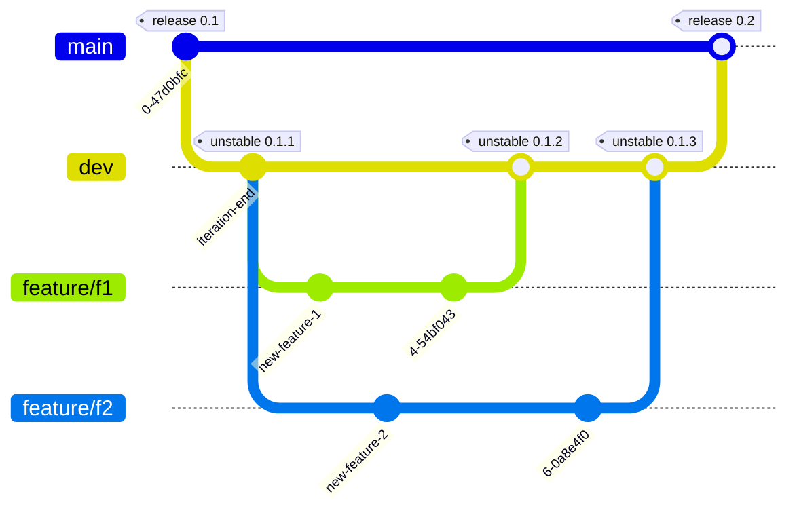

# Dusting Books
Ein Programm zur einfachen Verwaltung von Literatur und Quellen für LaTeX Projekte.
Dusting Books zeichnet sich durch seine vielen Schnittstellen und maximale Anpassbarkeit aus.

# Features
Folgende Features werden unterstützt (werden):
- [ ] Bibliotheken zum serialisieren und deserialisieren von `.bib` Dateien
- [ ] Benutzerdefinierte Validierung
- [ ] UI zur einfachen Interaktion
- [ ] API über Socket und REST
- [ ] OS Background Service

# Komponenten
Das Projekt wird in Module aufgeteilt, die unabhängig voneinander entwickelt werden.

## Bibtex Parser
Diese Bibliothek interpretiert `.bib` Dateien und stellt sie als Strukturen zur Verfügung.

## Bibtex Validator
Validiert anhand von benutzerdefinierten Bedingungen, ob es sich um valides Bibtex handelt.
Es gibt einen Report aus. Kann fehlschlagen oder nur Warnungen ausgeben.

## GUI
Für das grafische Interface wird auf [Tauri](https://v2.tauri.app/) gesetzt. Parameter:
- Sprache: `TypeScript`
- Packet Manager: `npm`
- Template: `Angular`
- UI-Framework: Entscheidung ausstehend

# Branching-Modell

Dieses Repository verwendet ein einfaches, strukturiertes Branching-Modell, um Entwicklung und Veröffentlichung sauber voneinander zu trennen.

## Branches

- **`main`** enthält **immer die stabile und veröffentlichte Version** des Projekts. Änderungen in diesen Branch werden nur durch Merges aus `dev` vorgenommen.

- **`dev`** ist der zentrale **Entwicklungszweig**. Hier werden alle neuen Features zusammengeführt, getestet und auf Stabilität geprüft. Am Ende jedes Sprints wird der aktuelle Stand von `dev` in `main` gemergt.

- **`feature/<beschreibung>`** Für jede neue Funktion oder Aufgabe wird ein eigener Feature-Branch vom `dev`-Branch aus erstellt. Sobald die Entwicklung abgeschlossen ist, wird der Feature-Branch in `dev` gemergt und anschließend gelöscht.

## Workflow

1. Entwickler erstellen einen Branch:  
   `git checkout -b feature/meine-funktion dev`

2. Nach Fertigstellung:
    - Pull Request gegen `dev`
    - Review & Merge
    - Branch löschen

3. Am Ende des Sprints:
    - Merge von `dev` nach `main`
    - Erstellung eines Releases

## Diagramm

